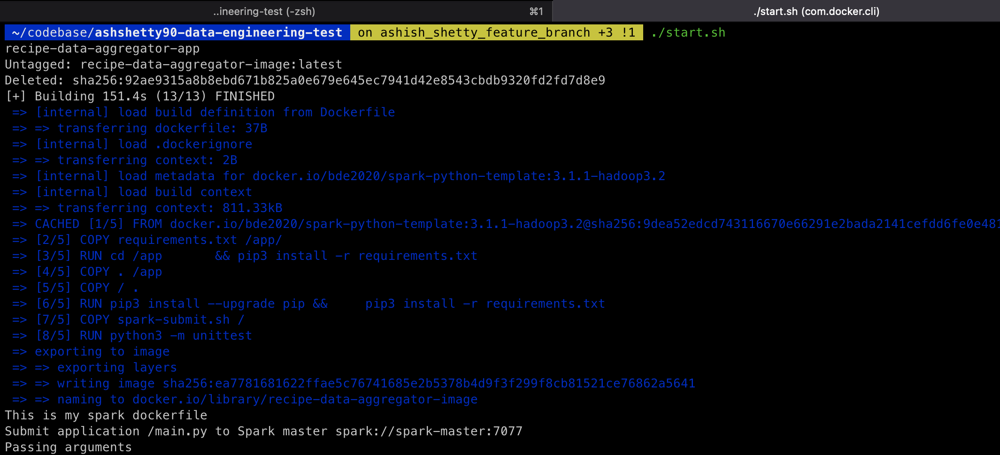
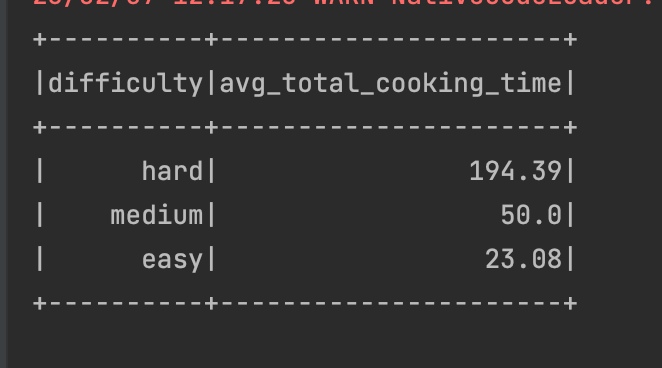

# Recipe Cooking Time Aggregator

# Overview:
A containerised spark application that aggregates the cooking time for a recipe and maps the average total cooking time to the difficulty of the recipe

# Language/Tools/Framework used
* Python 3.8
* Spark 3.1.1
* Docker

# Steps to run the Application
After having successfully downloaded the application repository, please go to the root directory of the app. In this case it's _ashshetty90-data-engineering-test_

## Option - 1 : With Docker( Recommended)
* Once in the root directory of the app, Run the  command `chmod +x start.sh` to get execution access to the shell script
* Ensure docker is installed on the machine. If not please follow the steps [here](https://docs.docker.com/desktop/install/mac-install/) to do so
* Once docker is installed, you can now run the app using `./start.sh` on the terminal. This will internally create a docker image, run all tests, spin up the container and lastly run the spark job to product the output.
* The docker volume which would have the csv output is mounted to the `/output` directory present in the app. Once the job is run successfully, you can see the parquet and csv files from task 1 and 2 respectively present in your app's local file system under `/output`
* Please note there is no action required from your end to beyond just trigger the shell script

## Option - 2 : With Installed Python
* If you haven't installed python on your machine yet, please make sure you follow the steps to do so [here](https://docs.python.org/3.8/using/mac.html)
* Please install `pip3 install -r requirements.txt` on the terminal
* Run all the tests  on the terminal using `python3 -m unittest` command( You will notice an exception thrown but that is part of the test check. Attaching screenshots for ref)
* Once python has been successfully installed, go into the root of the app directory and run `python3 main.py`
* This will output all the parquet and csv files in the _/output/task_1_ and _/output/task_2_ directories respectively

## Option - 3: With  Pycharm IDE
* If you are using an IDE to run the app, make sure the project is imported into the IDE.
* Once successfully imported it will prompt you to configure a python interpreter(Python 3.8). On this step you can either use your installed python mentioned in Option-2 or configure the python virtual environment.
* In both cases, the IDE will have a play button next to the `__main__` method in _main.py_ file.
* Once the job runs successfully, all the parquet and csv files in the _/output/task_1_ and _/output/task_2_ directories respectively
* In addition to that, you can also run all the test by running all the methods in the **tests/** directory by right-clicking the directory and clicking run all tests.

# Screenshots
### Docker Setup : 

###  Output

### Tests:

# What can be done better
* Accept the csv files and other parameters as command line arguments or access via yaml file
* More generic handling of filter and aggregation queries
* Automated deploying of the app. [docker-compose.yml](docker-compose.yml) attached
* Scheduling the job via Cron. Sample code added [here](Dockerfile) from line numbers 15 to 22
